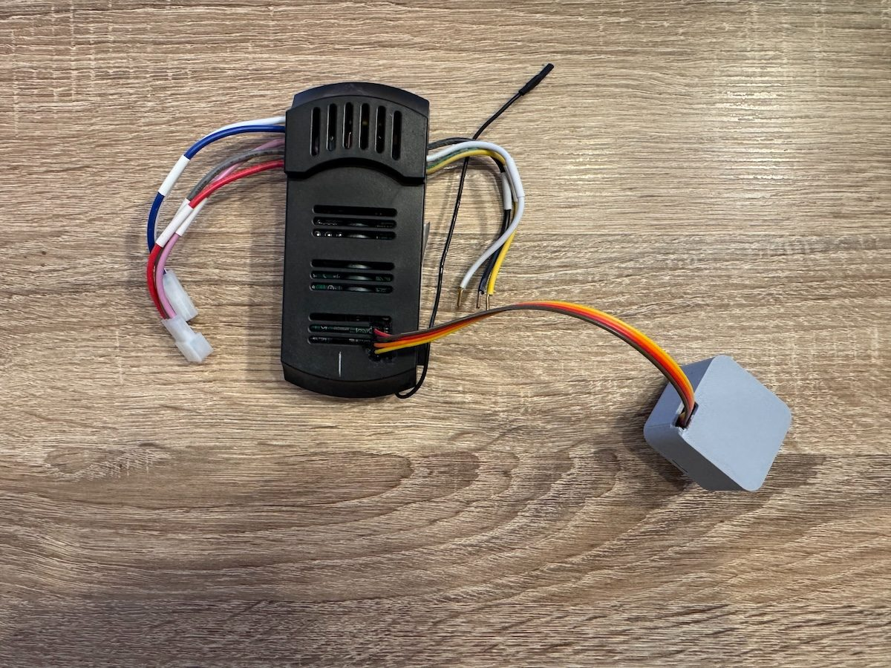
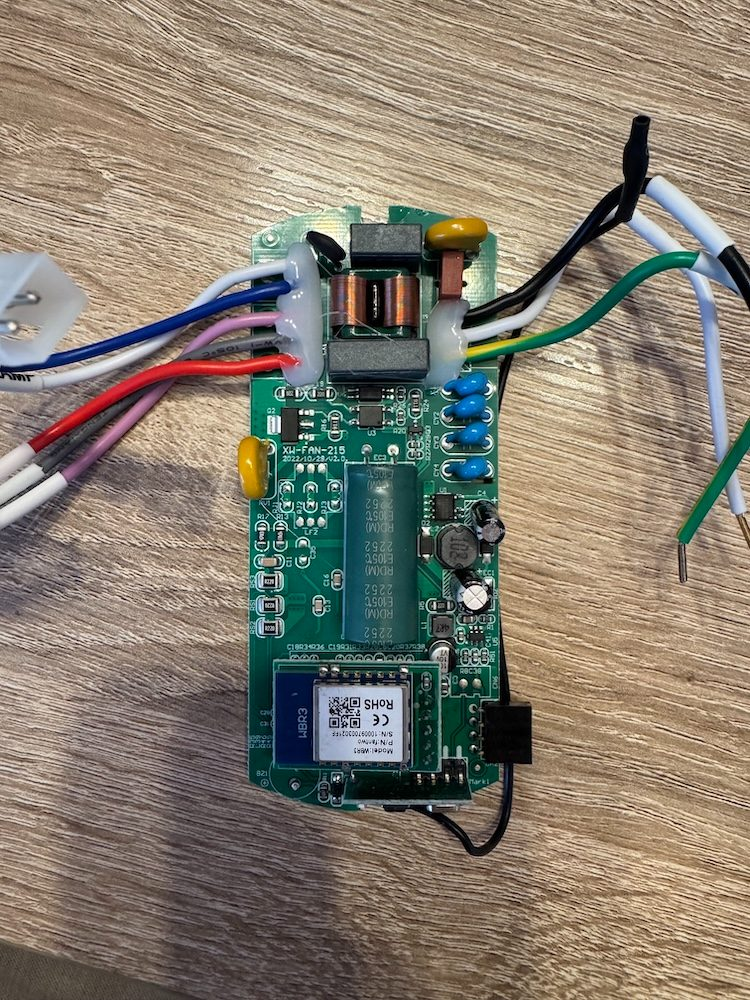
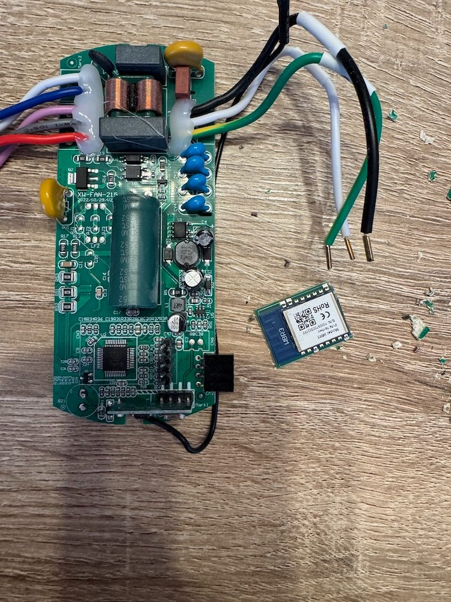
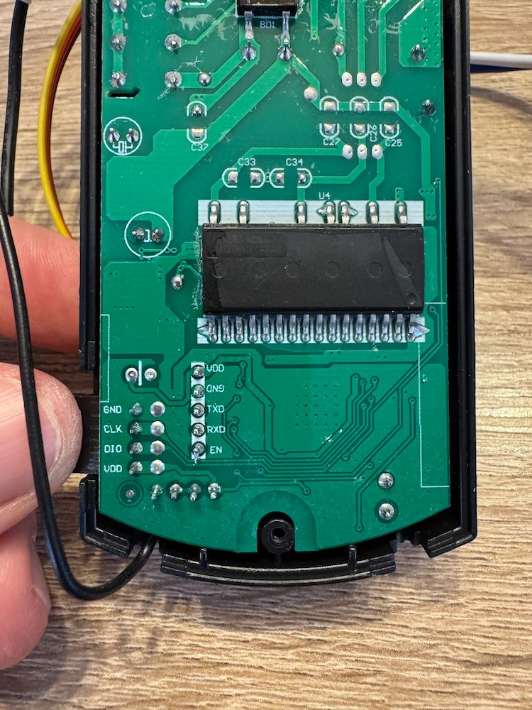
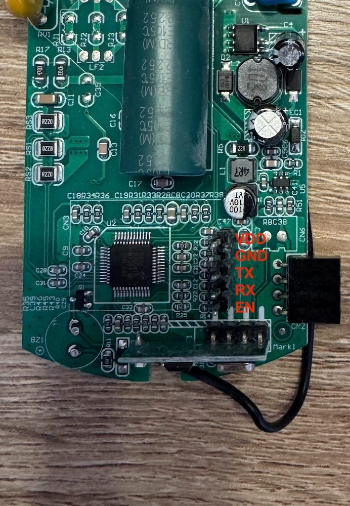
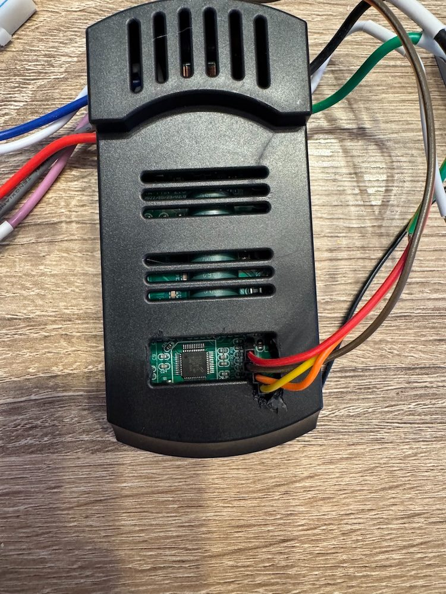
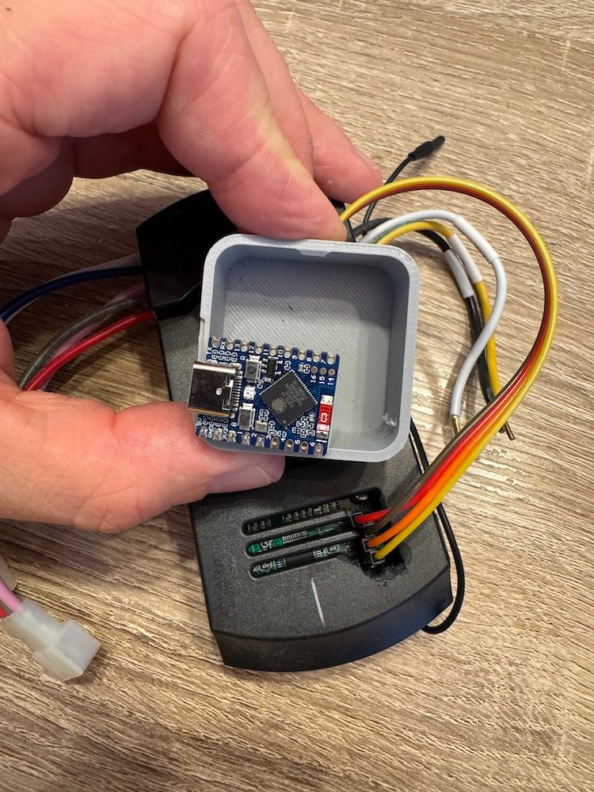

esphome-create-ceiling-fan

> Switch your Create ceiling fan from tuya (Smart Life) to ESPHome.

I own 4 ceiling Create DC ceiling fans, 3 with light, 1 with just a fan.
I wanted to get rid of Tuya Smart Life. So I swapped the brain of these modules.



- Why switching to ESPHome?
  - Privacy: a company does not need to know if I turn on my fan or light.
  - Performances: local control is much faster and reliable than cloud-based control.
  - Flexibility: you cannot set the default behavior of the light. If you have a power outtage that last more than 5 seconds, the light will turned on when the power is back. It happened at 3am, and there's no way to prevent that.

- Why a brain switch?
  - The "smart" module provided is a non-flashable ESP, or, on the latest version, a small microcontroller.
  - These modules do not control the device but just talk to a Tuya MCU, which is simpler than reverse engineering the whole PCB.
  - It was easier for me to remove the current module completely and use a small ESP32-S3 rather swaping the modules I have to a ESP-12F. And the latest module is not an ESP.

- I use the remote, will I be able to continue to use it?
  - Yes my lord, as long as you do not destroy the radio component.
  - The remote also act as an MCU communicator, so the state of the light/fan will be visible in HA 🎉

## Procedure

It's pretty straight forward:

1. Remove the old module. I went the destructive way with my Dremel. If you do the same, **make sure you do not touch any other component!** Damaging any component is very dangerous, it can lead to electric shock or fire. If you damage it, you will have to write to Create support to buy a new module. If you do it, do it are your own risk.




2. Clean the pins: I use my soldering iron on the pins directly. Same as before, **make sure you do not touch any other component**, there are a lot of capacitor on the PCB.
3. Wire the pins: you can see on the back face there are `VDD`, `GND`, `TX`, `RX` and `EN`:
  - `VDD`: outputs **3.3V**, enough to power an ESP
  - `GND`: ground
  - `TX`: plugged to an ESP pin setup as **`TX`**
  - `RX`: plugged to an ESP pin setup as **`RX`**
  - `EN`: not used




4. You have to create a hole in the plastic box to let the wires go, unless you could fit it super close to the PCB - which is not recommended -, it wont fit in the ceiling holder.




If you ask, I printed [this box](https://makerworld.com/fr/models/1000458-snap-fit-box-customize-or-small-ready-print?profileId-977820#profileId-977820) in PETG with just a `12*4*6 mm` negative part.

5. Flash your ESP:
```yaml
packages:
  remote_package_fan: github://bemble/esphome-create-ceiling-fan/comp-fan.yml@main
  # If you have a ceiling fan + light
  remote_package_light: github://bemble/esphome-create-ceiling-fan/comp-light.yml@main
  # If you want to turn the light off when device starts.
  # The light will be turned off if on, you can see a flash, there is no other way.
  remote_package_off_light: github://bemble/esphome-create-ceiling-fan/comp-turn-off-light-at-start.yml@main

# All your ESPHome basic stuff 
esphome:
  name: ceiling-fan
  friendly_name: Ceiling fan

esp32:
  board: esp32-s3-devkitc-1
  framework:
    type: esp-idf

# [...]

uart:
  # Adjust pins based on which ESP you use (e.g., GPIO1/3 for ESP8266)
  tx_pin: GPIO1
  rx_pin: GPIO2
  baud_rate: 9600
```
6. Plug the ESP, put back the module, and you're ready to go.


## Common errors

`Initialization failed. Current init_state: 0`: switch TX and RX